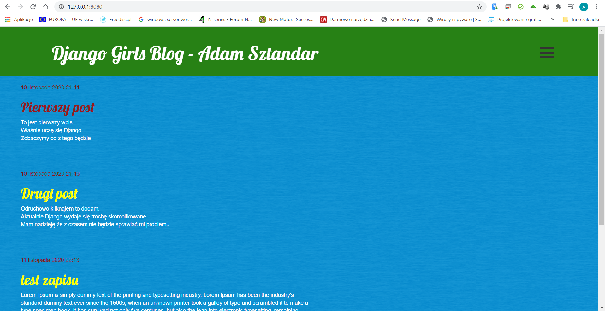
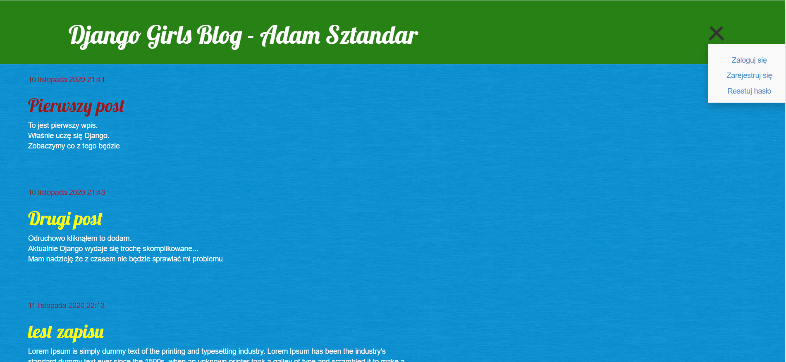
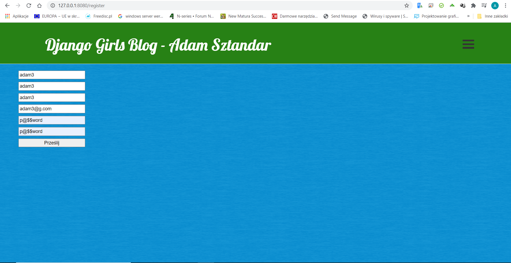
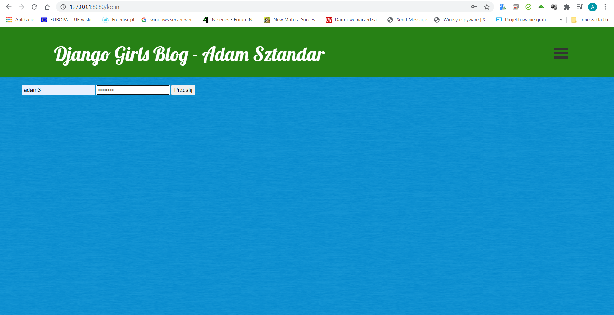
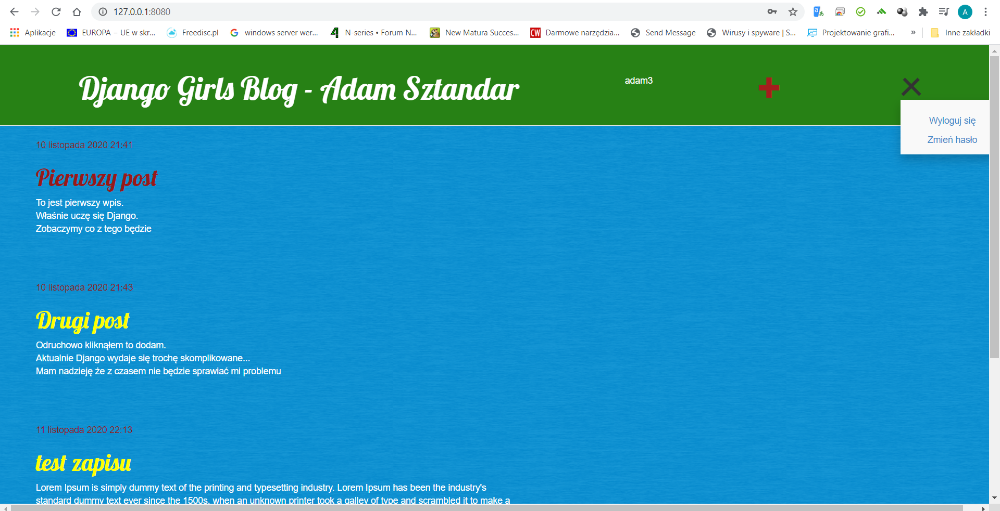
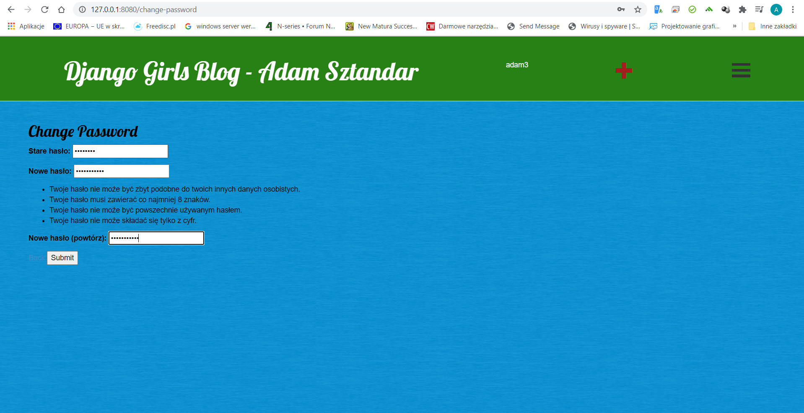
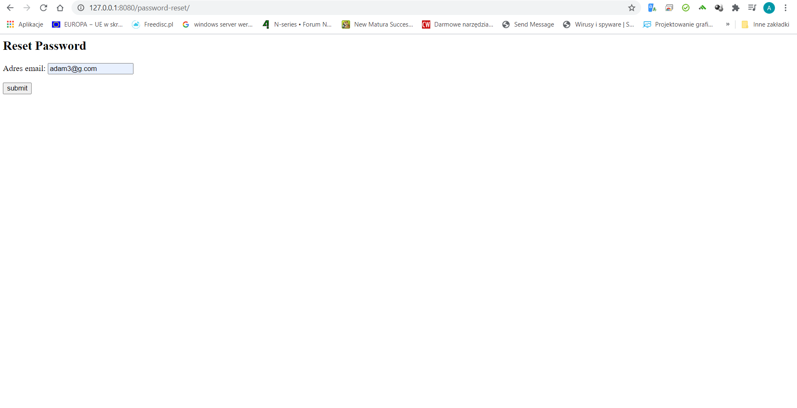
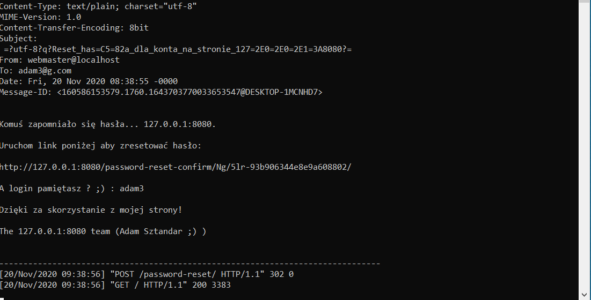
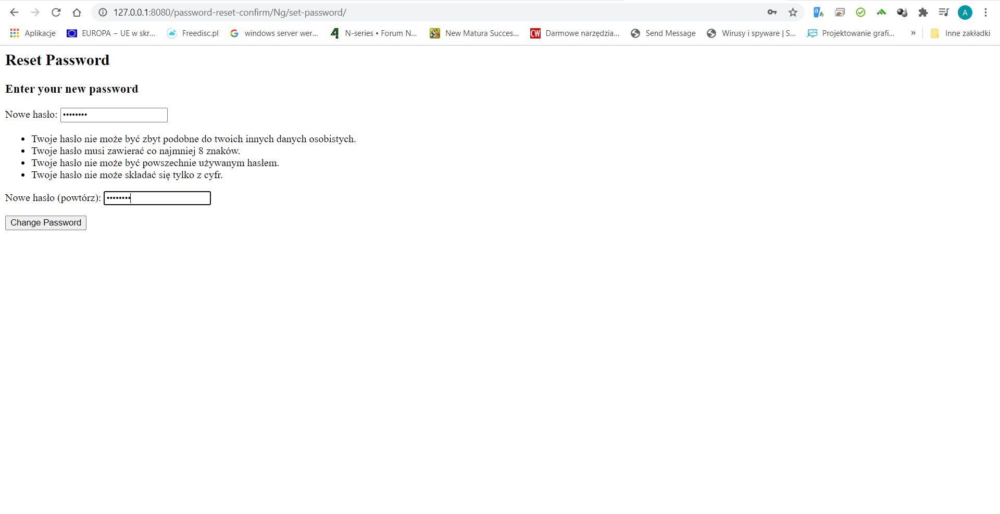
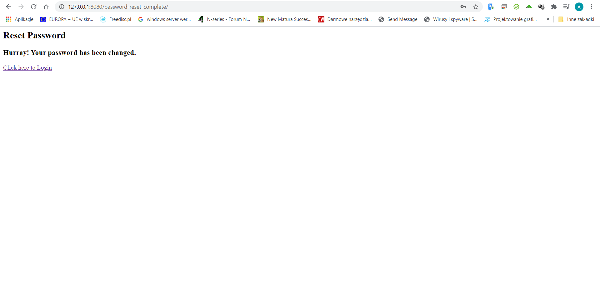

# aplikacje-internetowe-sztandar_adam-185ic

### Wykorzystane technologie.
* HTML5
* Bootstrap
* CSS
* Django
* Heroku

### Przedstawienie rezultatów.
__Strona główna__ -

__Menu niezalogowany__ - 

__Rejestracja__ - 

__Logowanie__ - 

__Menu po zalogowaniu__ - 

__Zmiana hasła__ - 

__Resetowanie hasła__ - 

